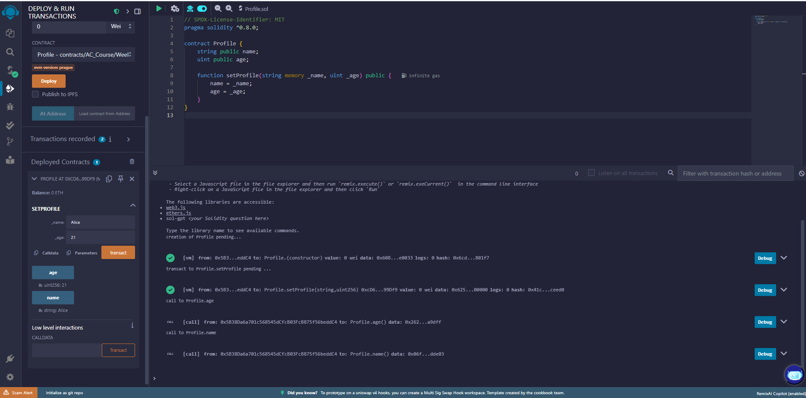

# Bài 3.1 – Kiểu dữ liệu và biến Solidity

## 🧠 Mã nguồn Solidity

```solidity
// SPDX-License-Identifier: MIT
pragma solidity ^0.8.0;

contract Profile {
    string public name;
    uint public age;

    function setProfile(string memory _name, uint _age) public {
        name = _name;
        age = _age;
    }
}
```


## Kết quả sau khi gọi setProfile("Alice", 21)



