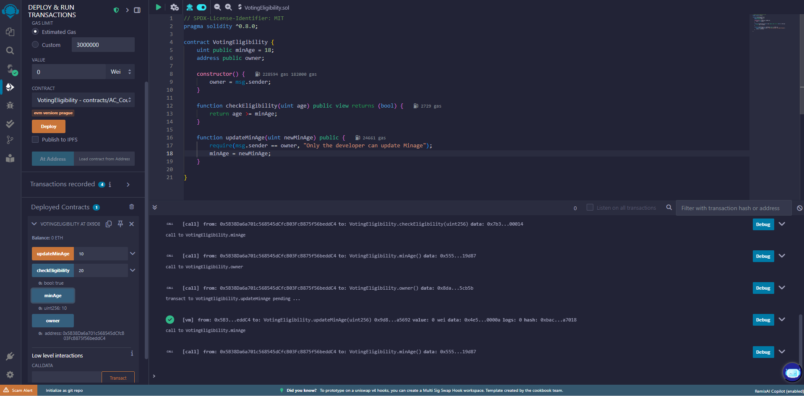
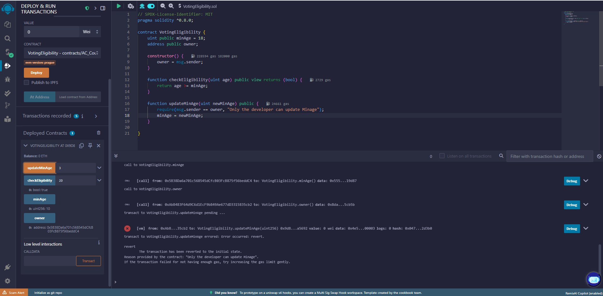

# Bài 3.2 – Hàm, Control Flow và Visibility

## 💡 Mã nguồn Solidity

```solidity
// SPDX-License-Identifier: MIT
pragma solidity ^0.8.0;

contract VotingEligibility {
    uint public minAge = 18;
    address public owner;

    constructor() {
        owner = msg.sender;
    }

    function checkEligibility(uint age) public view returns (bool) {
        return age >= minAge;
    }

    function updateMinAge(uint newMinAge) public {
        require(msg.sender == owner, "Only the deployer can update minAge");
        minAge = newMinAge;
    }
}
```

## Kết quả sau khi gọi hàm checkEligibility và updateMinAge



## Kết quả khi người không thực hiện deploy gọi hàm updateMinAge 



