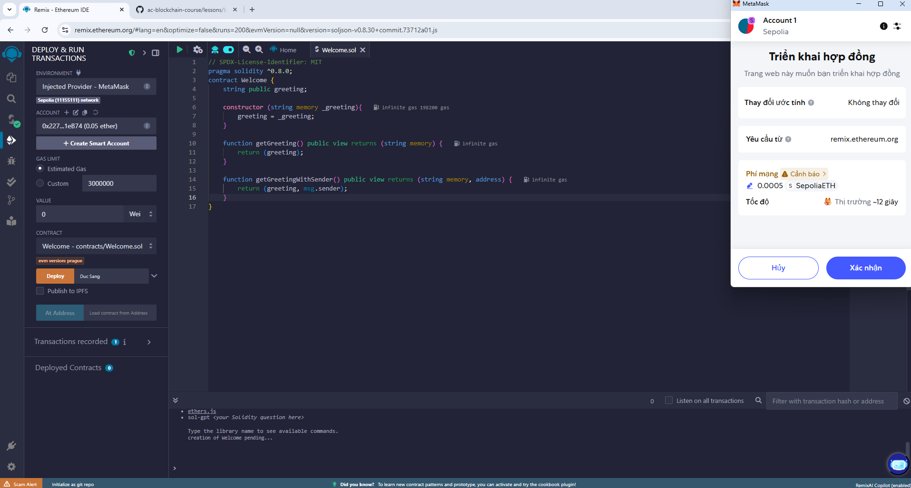
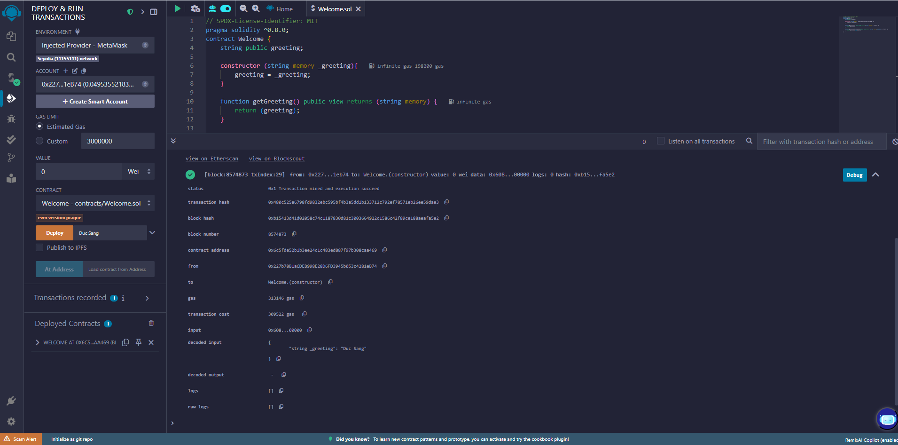
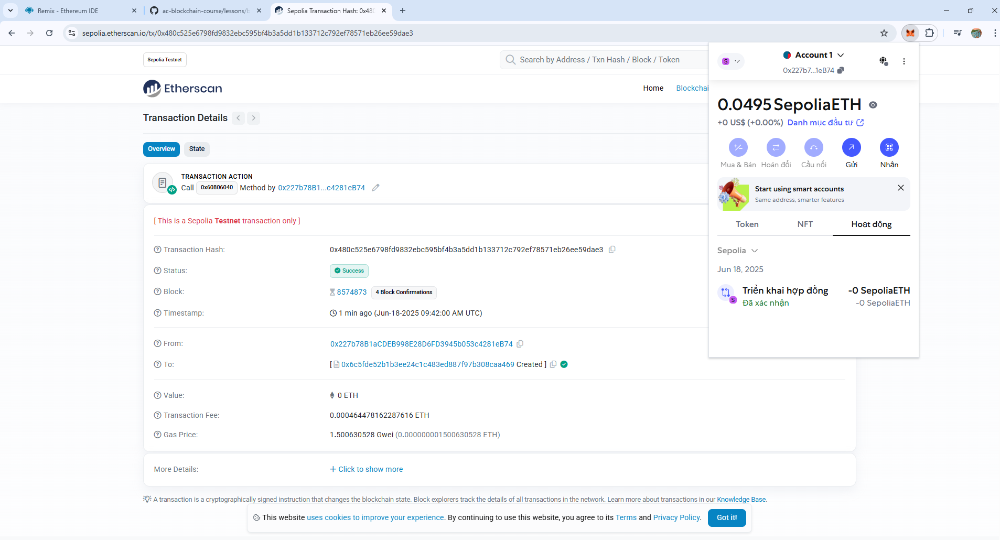
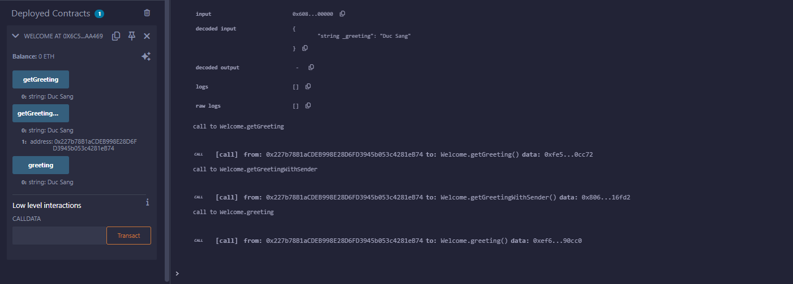
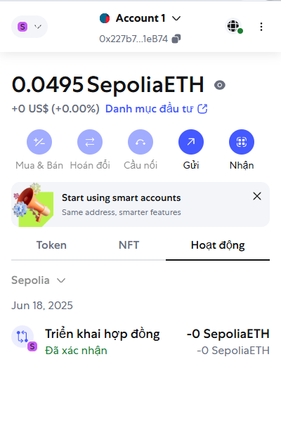

# Bài 3.3: Triển khai & Gỡ lỗi Hợp đồng Đầu Tiên trên Mạng Thử Nghiệm (Testnet)

## Triển khai Hợp đồng trên Testnet

- Chúng ta sẽ sử dụng một hợp đồng Solidity đơn giản mang tên `Welcome.sol`:

  ```solidity
  // SPDX-License-Identifier: MIT
  pragma solidity ^0.8.0;
  contract Welcome {
      string public greeting;
      
      constructor (string memory _greeting){
          greeting = _greeting;
      }

      function getGreeting() public view returns (string memory) {
          return (greeting);
      }

      function getGreetingWithSender() public view returns (string memory, address) {
          return (greeting, msg.sender);
      }
  }
  ```

- Sau khi biên dịch (Compile), bạn chọn **Deploy**, lúc này MetaMask sẽ xuất hiện yêu cầu xác nhận giao dịch:

  

- Khi hợp đồng được triển khai thành công, bạn sẽ thấy các thông tin liên quan như sau:

  

---

## Xác minh trên Etherscan

- Truy cập vào [Sepolia Etherscan](https://sepolia.etherscan.io) và dán vào transaction hash vừa nhận được để kiểm tra:

  

- Tại đây bạn sẽ thấy các chi tiết như:

  - Trạng thái: `Success`
  - Số block và số lượng xác nhận
  - Địa chỉ ví gửi và địa chỉ khởi tạo contract
  - Phí gas tiêu tốn khoảng ~0.00046 ETH

- Đồng thời, trong giao diện MetaMask cũng ghi lại toàn bộ lịch sử hoạt động như việc triển khai và các thao tác khác với contract.

---

## Gỡ lỗi và Kiểm tra

- Sau khi triển khai, trong Remix sẽ xuất hiện phần **Deployed Contracts** giúp bạn tương tác với hợp đồng.
- Ví dụ, khi bạn gọi hàm `getGreeting`, vì đây là hàm dạng `view` nên không tốn gas:

  

---

## Theo dõi lịch sử giao dịch tài khoản

  
