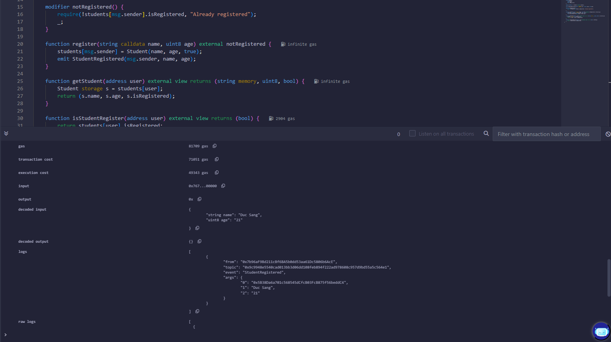

# Bài 4.1 – Mapping, Struct, Array

## 💡 Mã nguồn Solidity

```solidity
// SPDX-License-Identifier: MIT
pragma solidity ^0.8.0;

contract StudentRegistry {
    struct Student {
        string name;
        uint8 age;
        bool isRegistered;
    }

    mapping (address => Student) private students;

    event StudentRegistered(address indexed user, string _name, uint age);

    modifier notRegistered() {
        require(!students[msg.sender].isRegistered, "Already registered");
        _;
    }

    function register(string calldata name, uint8 age) external notRegistered {
        students[msg.sender] = Student(name, age, true);
        emit StudentRegistered(msg.sender, name, age);
    } 

    function getStudent(address user) external view returns (string memory, uint8, bool) {
        Student storage s = students[user];
        return (s.name, s.age, s.isRegistered);
    }

    function isStudentRegister(address user) external view returns (bool) {
        return students[user].isRegistered;
    }
}
```

## Kết quả sau khi gọi hàm register



## Kết quả sau khi gọi hàm getStudent và isStudentRegistered


