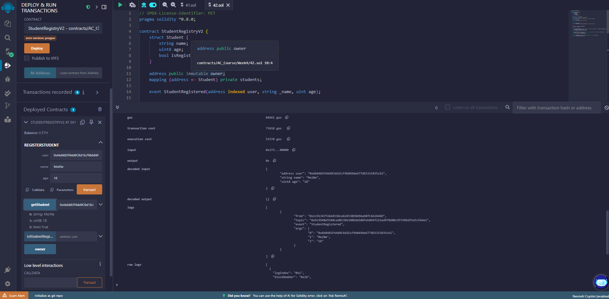

# Bài 4.2 – Modifier, Event và Quyền Truy Cập

## 💡 Mã nguồn Solidity

```solidity
// SPDX-License-Identifier: MIT
pragma solidity ^0.8.0;

contract StudentRegistryV2 {
    struct Student {
        string name;
        uint8 age;
        bool isRegistered;
    }

    address public immutable owner;
    mapping (address => Student) private students;

    event StudentRegistered(address indexed user, string _name, uint age);

    modifier onlyOwner() {
        require(msg.sender == owner, "Not owner");
        _;
    }

    modifier notRegistered() {
        require(!students[msg.sender].isRegistered, "Already registered");
        _;
    }

    constructor() {
        owner = msg.sender;
    }

    function registerStudent(address user, string calldata name, uint8 age) external onlyOwner notRegistered {
        students[user] = Student(name, age, true);
        emit StudentRegistered(user, name, age);
    }

    function getStudent(address user) external view returns (string memory, uint8, bool) {
        Student storage s = students[user];
        return (s.name, s.age, s.isRegistered);
    }

    function isStudentRegister(address user) external view returns (bool) {
        return students[user].isRegistered;
    }
}

```

## Deploy → Test registerStudent(), kiểm tra event log và kết quả đọc student.




