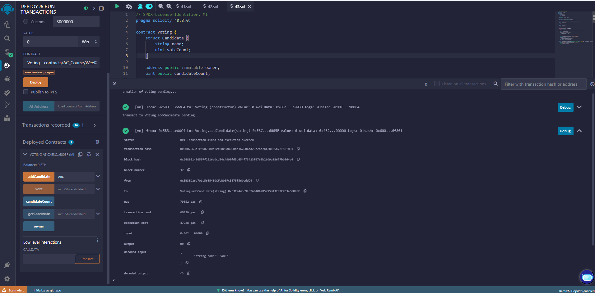
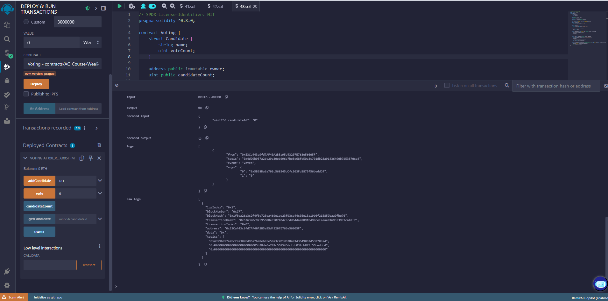
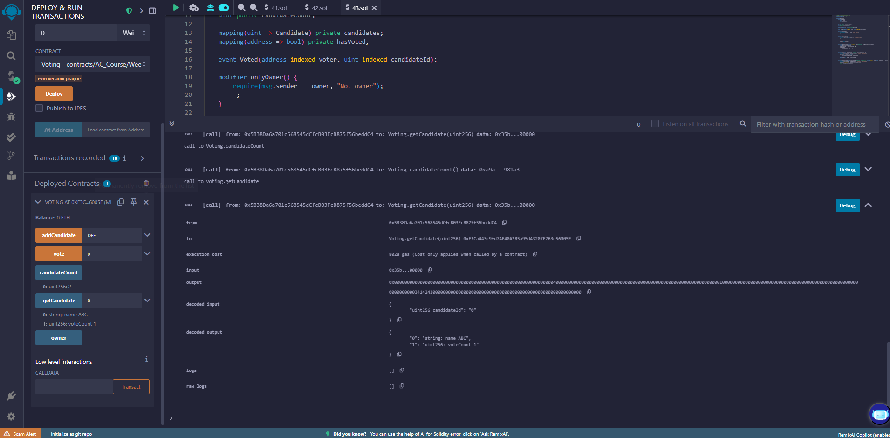

# Bài 4.3 – Voting Smart Contract

## 💡 Mã nguồn Solidity

```solidity
// SPDX-License-Identifier: MIT
pragma solidity ^0.8.0;

contract Voting {
    struct Candidate {
        string name;
        uint voteCount;
    }

    address public immutable owner;
    uint public candidateCount;

    mapping(uint => Candidate) private candidates;
    mapping(address => bool) private hasVoted;

    event Voted(address indexed voter, uint indexed candidateId);

    modifier onlyOwner() {
        require(msg.sender == owner, "Not owner");
        _;
    }

    modifier notVoted() {
        require(!hasVoted[msg.sender], "Already voted");
        _;
    }

    constructor() {
        owner = msg.sender;
    }

    function addCandidate(string calldata name) external onlyOwner {
        uint id = candidateCount;
        candidates[id] = Candidate(name, 0);
        unchecked {
            candidateCount = id + 1;
        }
    }

    function vote(uint candidateId) external notVoted {
        require(candidateId < candidateCount, "Invalid candidate");
        hasVoted[msg.sender] = true;
        unchecked {
            candidates[candidateId].voteCount++;
        }
        emit Voted(msg.sender, candidateId);
    }

    function getCandidate(uint candidateId) external view returns (string memory name, uint voteCount) {
        require(candidateId < candidateCount, "Invalid candidate");
        Candidate storage c = candidates[candidateId];
        return (c.name, c.voteCount);
    }
}

```

## Thêm ứng viên (ABC và DEF)



## Vote ứng viên và event log 



## Kết quả phiếu



