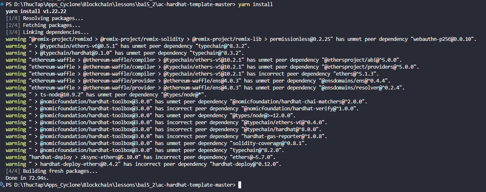
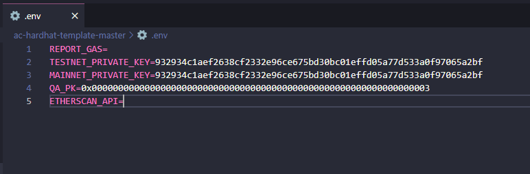
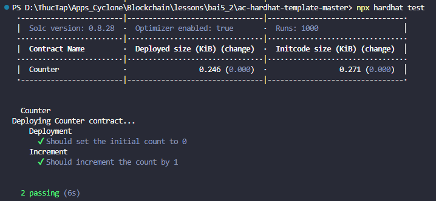
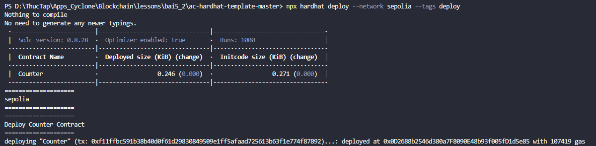
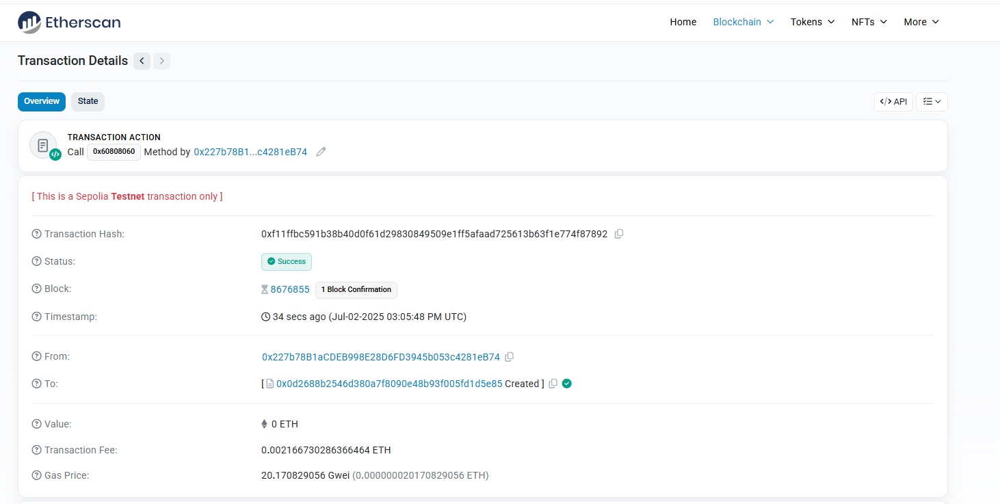
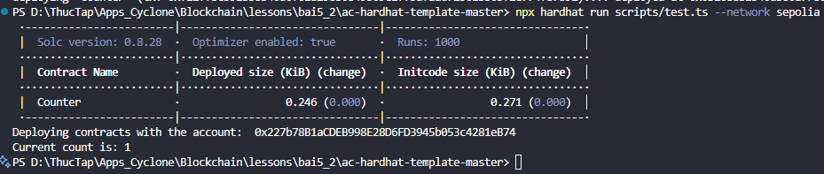
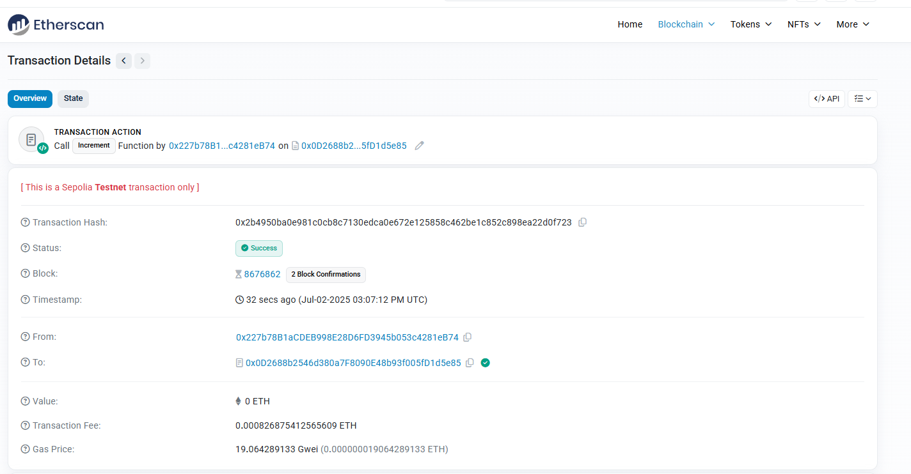

# Bài Tập 5.2 – Gửi Transaction dùng Ethers.js và Hardhat

## 🎯 Mục tiêu

- Deploy một smart contract đơn giản bằng Hardhat.
- Gọi hàm `increment()` từ contract bằng Ethers.js.
- In kết quả của `getCount()` ra console.

## ✅ Yêu cầu

Sử dụng template: https://github.com/appscyclone/ac-hardhat-template

## Các bước thực hiện

### 1. Cài đặt môi trường

- **Clone repo**:
  ```bash
  git clone https://github.com/appscyclone/ac-hardhat-template.git
  ```

- **Cài đặt dependencies**:
  ```bash
  yarn install
  ```

  

- **Tạo file `.env` với nội dung**:
  ```env
  REPORT_GAS=
  TESTNET_PRIVATE_KEY=<private_key_metamask>
  ETHERSCAN_API=
  ```

  

---

### 2. Biên dịch Contract

```bash
npx hardhat compile
```


---

### 3. Viết và chạy Unit Test

- Kiểm tra khởi tạo và hàm `increment()` trong `test/Counter.test.ts`:
```bash
npx hardhat test
```



---

### 4. Deploy lên mạng Sepolia

```bash
npx hardhat deploy --network sepolia --tags deploy
```

- Script `deploy/1-deploy.ts` sẽ triển khai contract `Counter`.



- Kiểm tra trên `Etherscan`.


---

### 5. Gọi hàm từ contract

```bash
npx hardhat run scripts/test.ts --network sepolia
```

- Script `scripts/test.ts` gọi `increment()` và `getCount()`, kết quả in ra console là `1`.



- Kiểm tra trên `Etherscan`.


---

## 📌 Kết luận

- ✅ Đã deploy thành công contract `Counter` lên Sepolia.
- ✅ Gọi hàm `increment()` và `getCount()` thành công.
- ✅ Console hiển thị: `Current count is: 1`
