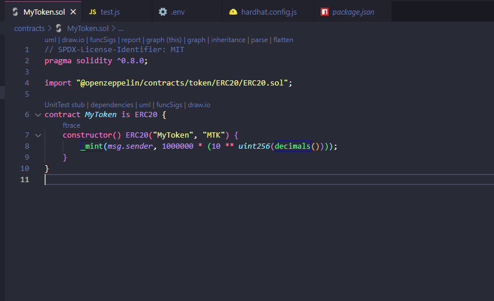
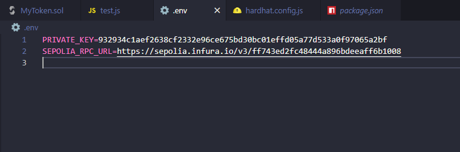
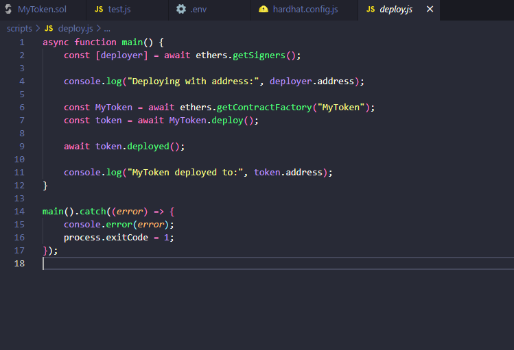
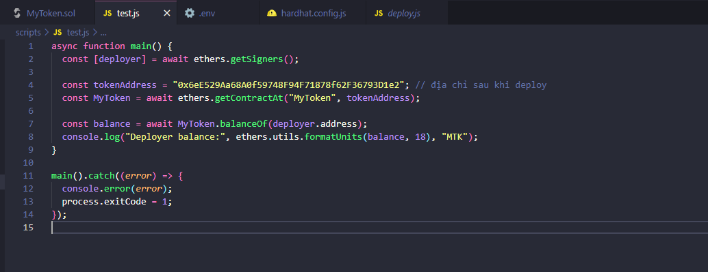
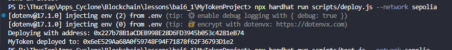
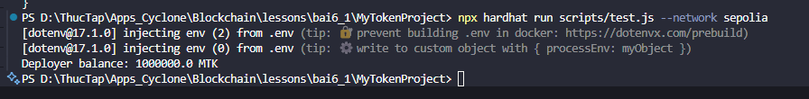

# Bài Tập 6.1 – Viết ERC20 Token cơ bản

## ✅ Mục tiêu

- Viết smart contract ERC20 Token đơn giản sử dụng OpenZeppelin.
- Deploy lên mạng testnet **Sepolia**.
- Kiểm tra số dư token của địa chỉ deployer.

---

## 📝 Các bước làm

## Cài đặt môi trường

Mở terminal và chạy:

```bash
mkdir MyTokenProject
cd MyTokenProject
npm init -y
npm install --save-dev hardhat
npx hardhat
```

Chọn: **Create a JavaScript project**, sau đó enter liên tục để hoàn tất.

---

## Cài đặt các package cần thiết

```bash
npm install @openzeppelin/contracts
npm install dotenv
npm install --save-dev @nomiclabs/hardhat-ethers ethers
```


### 1. Viết Smart Contract - `contracts/MyToken.sol`
<p align="center">
  
</p>


```solidity
// SPDX-License-Identifier: MIT
pragma solidity ^0.8.0;

import "@openzeppelin/contracts/token/ERC20/ERC20.sol";

contract MyToken is ERC20 {
    constructor() ERC20("MyToken", "MTK") {
        _mint(msg.sender, 1000000 * (10 ** uint256(decimals())));
    }
}
```

Token có:
- Tên: `MyToken`
- Symbol: `MTK`
- Tổng cung: `1,000,000 MTK` mint cho deployer

---

### 2. Thêm biến môi trường - `.env`
<p align="center">
  
</p>


```env
PRIVATE_KEY=*** (ẩn vì lý do bảo mật)
SEPOLIA_RPC_URL=https://sepolia.infura.io/v3/ff743ed2fc48444a896bdeeaff6b1008
```

---

### 3. Cấu hình mạng - `hardhat.config.js`
<p align="center">
  
</p>


```js
require("@nomiclabs/hardhat-ethers");
require("dotenv").config();

module.exports = {
  solidity: "0.8.28",
  networks: {
    sepolia: {
      url: process.env.SEPOLIA_RPC_URL,
      accounts: [process.env.PRIVATE_KEY]
    }
  }
};
```

---

### 4. Script deploy - `scripts/deploy.js`
<p align="center">
  
</p>


```js
async function main() {
  const [deployer] = await ethers.getSigners();
  console.log("Deploying with address:", deployer.address);

  const MyToken = await ethers.getContractFactory("MyToken");
  const token = await MyToken.deploy();
  await token.deployed();

  console.log("MyToken deployed to:", token.address);
}

main().catch((error) => {
  console.error(error);
  process.exitCode = 1;
});
```

---

### 5. Script kiểm tra balance - `scripts/test.js`
<p align="center">
  
</p>


```js
async function main() {
  const [deployer] = await ethers.getSigners();

  const tokenAddress = "0x6eE529Aa68A0f59748F94F71878f62F36793D1e2";
  const MyToken = await ethers.getContractAt("MyToken", tokenAddress);

  const balance = await MyToken.balanceOf(deployer.address);
  console.log("Deployer balance:", ethers.utils.formatUnits(balance, 18), "MTK");
}

main().catch((error) => {
  console.error(error);
  process.exitCode = 1;
});
```

---

## 🚀 Kết quả thực thi

### ✅ Deploy
<p align="center">
  
</p>


```bash
Deploying with address: 0x227b88a1cDE09882B06F394b5Bc34281e874
MyToken deployed to: 0x6eE529Aa68A0f59748F94F71878f62F36793D1e2
```

### ✅ Test Balance
<p align="center">
  
</p>


```bash
Deployer balance: 1000000.0 MTK
```

---

## 📌 Kết luận

- Smart contract ERC20 được viết đúng theo chuẩn.
- Token đã được deploy thành công lên Sepolia.
- Địa chỉ deployer nhận đúng tổng cung 1 triệu token `MTK`.
