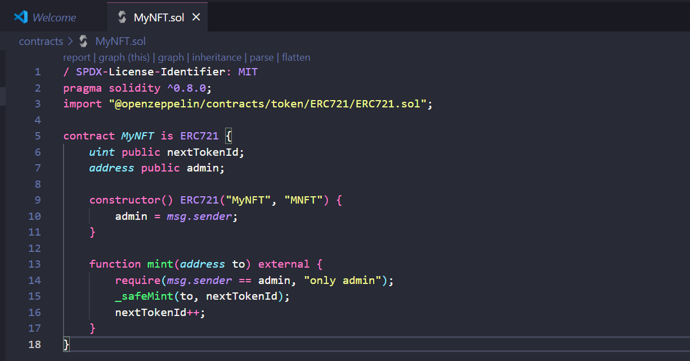
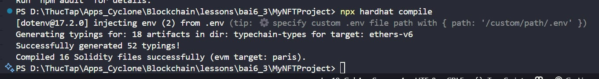
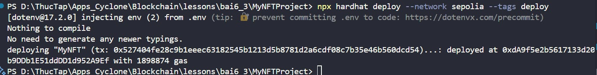
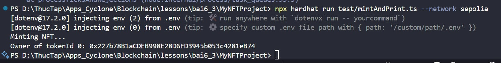

# Bài Tập 6.3 – Mint NFT bằng Hardhat


---

### Khởi Tạo Dự Án Hardhat

## Viết Smart Contract `MyNFT`

Tạo file `contracts/MyNFT.sol`:

```solidity
// SPDX-License-Identifier: MIT
pragma solidity ^0.8.20;

import "@openzeppelin/contracts/token/ERC721/ERC721.sol";
import "@openzeppelin/contracts/access/Ownable.sol";

contract MyNFT is ERC721, Ownable {
    uint256 public nextTokenId;

    constructor() ERC721("MyNFT", "MNFT") {}

    function mint(address to) external onlyOwner {
        _safeMint(to, nextTokenId);
        nextTokenId++;
    }
}
```

📸 *Ảnh minh họa nội dung file `MyNFT.sol`:*  
> 

---

##  Cấu Hình Mạng Sepolia

Tạo file `.env` và thêm:

```env
PRIVATE_KEY=0xyour_wallet_private_key
SEPOLIA_RPC_URL=https://sepolia.infura.io/v3/your_project_id
```

Cập nhật `hardhat.config.ts`:

```ts
import { HardhatUserConfig } from "hardhat/config";
import "@nomicfoundation/hardhat-toolbox";
import * as dotenv from "dotenv";
import "hardhat-deploy";

dotenv.config();

const config: HardhatUserConfig = {
  solidity: "0.8.28",
  networks: {
    sepolia: {
      url: process.env.SEPOLIA_RPC_URL || "",
      accounts: process.env.PRIVATE_KEY ? [process.env.PRIVATE_KEY] : [],
    },
  },
  namedAccounts: {
    deployer: {
      default: 0,
    },
  },
};

export default config;
```

---

## Tạo Script Triển Khai Contract

Tạo file `deploy/01_deploy_mynft.ts`:

```ts
import { HardhatRuntimeEnvironment } from "hardhat/types";
import { DeployFunction } from "hardhat-deploy/types";

const deployMyNFT: DeployFunction = async function (hre: HardhatRuntimeEnvironment) {
  const { deployments, getNamedAccounts } = hre;
  const { deploy } = deployments;
  const { deployer } = await getNamedAccounts();

  await deploy("MyNFT", {
    from: deployer,
    args: [],
    log: true,
  });
};

export default deployMyNFT;
deployMyNFT.tags = ["deploy"];
```
---

## Viết Script Mint & In Chủ Sở Hữu Token

Tạo file `test/mintAndPrint.ts`:

```ts
import { ethers, deployments, getNamedAccounts } from "hardhat";

async function main() {
  const { deployer } = await getNamedAccounts();

  const myNFT = await ethers.getContract("MyNFT", deployer);

  console.log("Minting NFT...");
  const tx = await myNFT.mint(deployer);
  await tx.wait();

  const owner = await myNFT.ownerOf(0);
  console.log("Owner of tokenId 0:", owner);
}

main().catch((error) => {
  console.error(error);
  process.exitCode = 1;
});
```

---

## Compile, Deploy và Chạy Script

### Compile:

```bash
npx hardhat compile
```
> 


### Deploy:

```bash
npx hardhat deploy --network sepolia --tags deploy
```
> 


### Mint & Kiểm Tra:

```bash
npx hardhat run test/mintAndPrint.ts --network sepolia
```

> 

---

## Kết Quả Mong Đợi

- ✅ Contract ERC721 được triển khai thành công lên mạng Sepolia  
- ✅ Token NFT đầu tiên (`tokenId = 0`) được mint cho tài khoản deployer  
- ✅ In ra địa chỉ sở hữu của token đó

