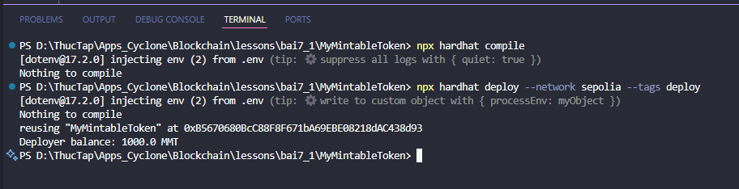
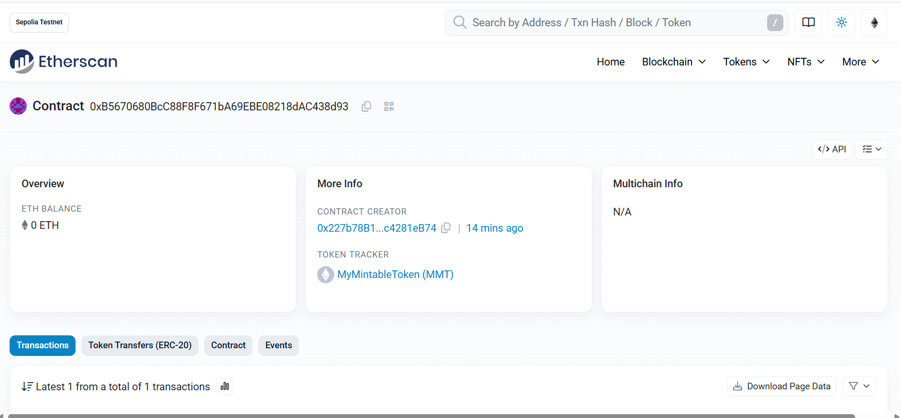

# Bài Tập 7.1 – Mint Token ERC20

## 🎯 Mục tiêu:
Viết, deploy và mint token ERC20 bằng Hardhat.

---

## ✅ Yêu cầu:
1. Viết contract MyMintableToken:
   - Kế thừa `ERC20`
   - Hàm `mint(address to, uint amount)` chỉ owner gọi được

2. Viết script deploy:
   - Deploy contract
   - Mint 1000 token cho deployer
   - In balance của deployer
---

## Các bước thực hiện:

### Bước 1: Tạo file Solidity `MyMintableToken.sol` trong thư mục `contracts/`
```solidity
// SPDX-License-Identifier: MIT
pragma solidity ^0.8.20;

import "@openzeppelin/contracts/token/ERC20/ERC20.sol";
import "@openzeppelin/contracts/access/Ownable.sol";

contract MyMintableToken is ERC20, Ownable {
    constructor() ERC20("MyMintableToken", "MMT") Ownable(msg.sender) {}

    function mint(address to, uint256 amount) public onlyOwner {
        _mint(to, amount);
    }
}
```

### Bước 2: Cấu hình file `hardhat.config.ts`
```ts
import { HardhatUserConfig } from "hardhat/config";
import "@nomiclabs/hardhat-ethers";
import "hardhat-deploy";
import * as dotenv from "dotenv";
dotenv.config();

const config: HardhatUserConfig = {
  solidity: "0.8.20",
  namedAccounts: {
    deployer: {
      default: 0,
    },
  },
  networks: {
    sepolia: {
      url: process.env.SEPOLIA_RPC_URL || "",
      accounts: process.env.PRIVATE_KEY ? [process.env.PRIVATE_KEY] : [],
    },
  },
};

export default config;
```

### Bước 3: Cấu hình TypeScript trong `tsconfig.json`
```json
{
  "compilerOptions": {
    "target": "es2020",
    "module": "commonjs",
    "esModuleInterop": true,
    "forceConsistentCasingInFileNames": true,
    "strict": true,
    "skipLibCheck": true,
    "resolveJsonModule": true,
    "types": ["hardhat"]
  }
}
```

### Bước 4: Tạo file `01-deploy.ts` trong thư mục `deploy/`
```ts
import { HardhatRuntimeEnvironment } from "hardhat/types";
import { DeployFunction } from "hardhat-deploy/types";
import { ethers } from "hardhat";

const deployFunc: DeployFunction = async function (hre: HardhatRuntimeEnvironment) {
  const { deployments, getNamedAccounts } = hre;
  const { deploy } = deployments;
  const { deployer } = await getNamedAccounts();

  const result = await deploy("MyMintableToken", {
    from: deployer,
    log: true,
  });

  const token = await ethers.getContractAt("MyMintableToken", result.address);
  const mintTX = await token.mint(deployer, ethers.utils.parseEther("1000"));
  await mintTX.wait();

  const balance = await token.balanceOf(deployer);
  console.log(`Deployer balance: ${ethers.utils.formatEther(balance)} MMT`);
};

export default deployFunc;
deployFunc.tags = ["deploy"];
```

### Bước 5: Tạo file `.env`
```
SEPOLIA_RPC_URL=https://sepolia.infura.io/v3/YOUR_PROJECT_ID
PRIVATE_KEY=your_private_key_here
```

### Bước 6: Compile contract
```bash
npx hardhat compile
```

### Bước 7: Deploy lên mạng Sepolia
```bash
npx hardhat deploy --network sepolia --tags deploy
```

### ✅ Kết quả đầu ra (theo ảnh):
<p align="center">
  
</p>

### Kiểm tra trên etherscan:
<p align="center">
  
</p>
## 💡 Ghi chú:
- Hàm `mint()` chỉ được gọi bởi `owner` nhờ kế thừa `Ownable` và sử dụng `onlyOwner` modifier.
- Đảm bảo file `.env` chứa đầy đủ RPC URL và PRIVATE_KEY.
