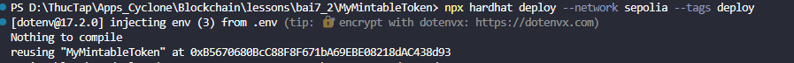
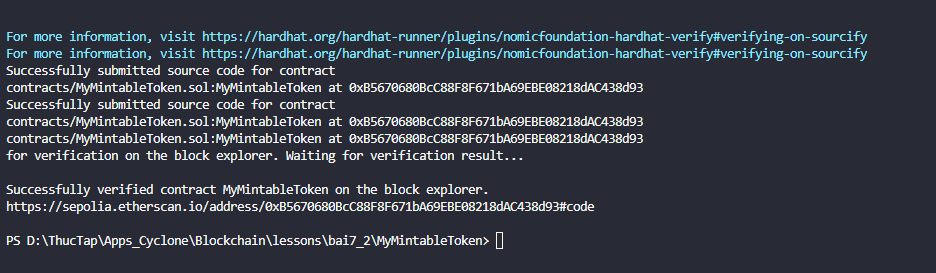
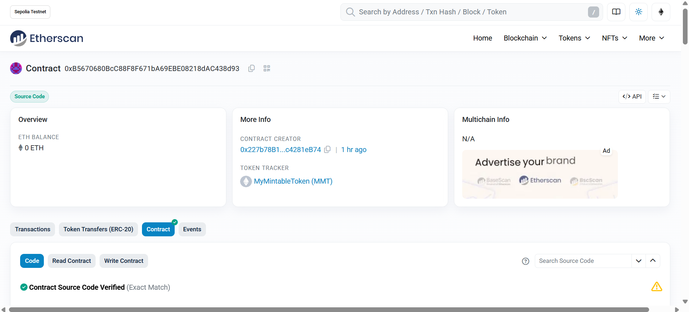
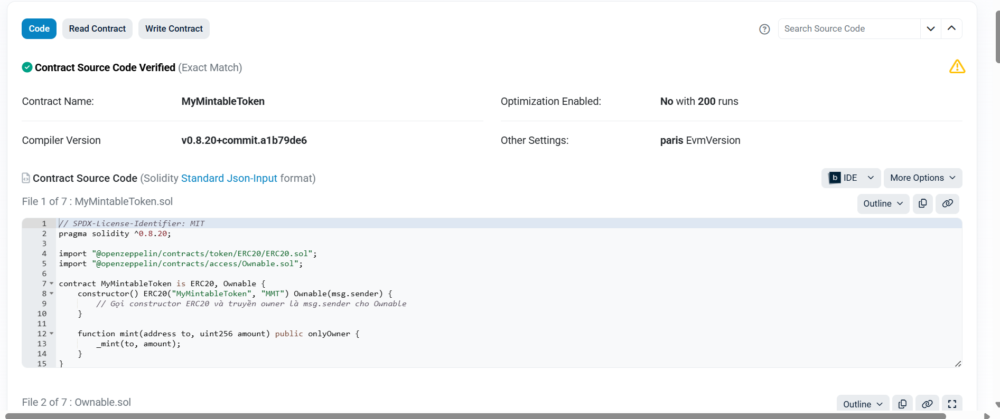

# Bài Tập 7.2 – Verify MyMintableToken trên Etherscan

## 🎯 Mục tiêu
- Deploy contract ERC20 `MyMintableToken` lên mạng Sepolia.
- Verify contract trên Etherscan.

---

## Các bước thực hiện

### Bước 1 – Cài đặt plugin verify
```bash
npm install --save-dev @nomicfoundation/hardhat-verify
```

### ⚙ Bước 2 – Cấu hình hardhat.config.ts
```typescript
import { HardhatUserConfig } from "hardhat/config";
import "@nomiclabs/hardhat-ethers";
import "hardhat-deploy";
import * as dotenv from "dotenv";
import "@nomicfoundation/hardhat-verify";

dotenv.config();

const config: HardhatUserConfig = {
  solidity: "0.8.20",
  namedAccounts: {
    deployer: {
      default: 0,
    },
  },
  networks: {
    sepolia: {
      url: process.env.SEPOLIA_RPC_URL,
      accounts: process.env.PRIVATE_KEY ? [process.env.PRIVATE_KEY] : [],
    },
  },
  etherscan: {
    apiKey: process.env.ETHERSCAN_API_KEY || "YOUR_ETHERSCAN_API_KEY",
  },
};

export default config;

```


### 🚀 Bước 3 – Deploy contract
```bash
npx hardhat deploy --network sepolia --tags deploy
```
Output:
```
MyMintableToken deployed to: 0xB5670680BcC88F8F671bA69EBE08218dAC438d93
```



### 🚀 Bước 4 – Verify contract

```bash
npx hardhat verify --network sepolia 0xB5670680BcC88F8F671bA69EBE08218dAC438d93
```

```
Successfully verified contract MyMintableToken on the block explorer.
https://sepolia.etherscan.io/address/0xB5670680BcC88F8F671bA69EBE08218dAC438d93#code
```




---

### ✅ Bước 5 – Kiểm tra trên Etherscan
- Source code đã được verify, hiển thị công khai trên tab **Contract**.
- Có thể xem các hàm trên tab `Read Contract` và `Write Contract`.




---

## 🎯 Nộp bài

- **Địa chỉ contract:**  
```
0xB5670680BcC88F8F671bA69EBE08218dAC438d93
```

- **Link verify trên Etherscan:**  
[https://sepolia.etherscan.io/address/0xB5670680BcC88F8F671bA69EBE08218dAC438d93#code](https://sepolia.etherscan.io/address/0xB5670680BcC88F8F671bA69EBE08218dAC438d93#code)

- **Screenshot verify thành công:**  
(Đính kèm từ hình đã chụp:  
✅ Hardhat terminal verify success và  
✅ Etherscan hiển thị Contract Source Code Verified)


